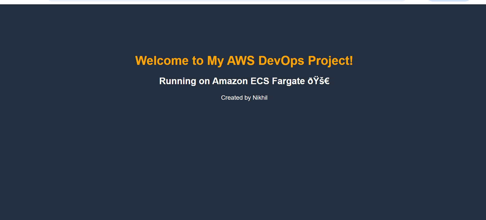
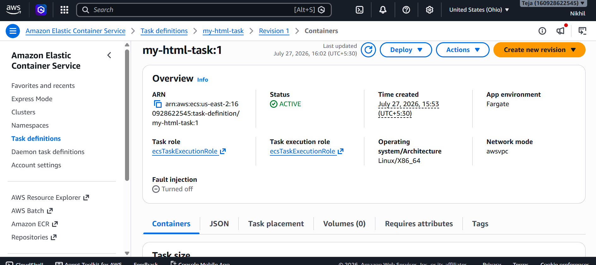
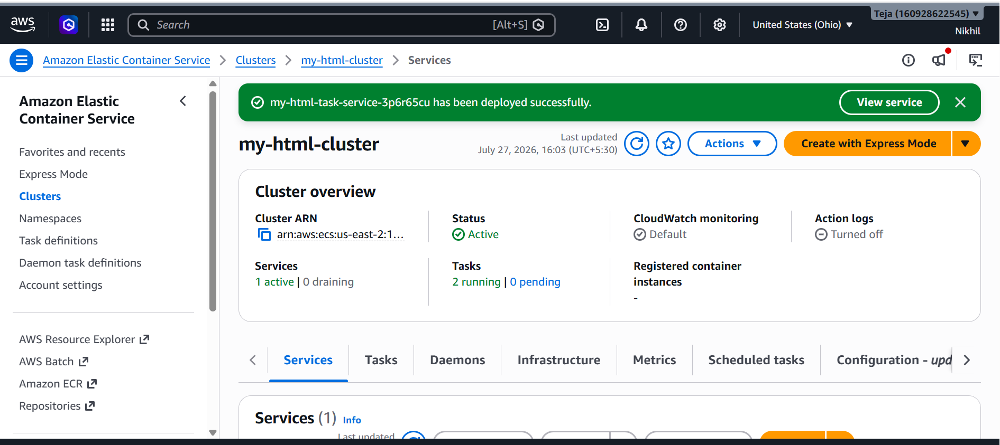
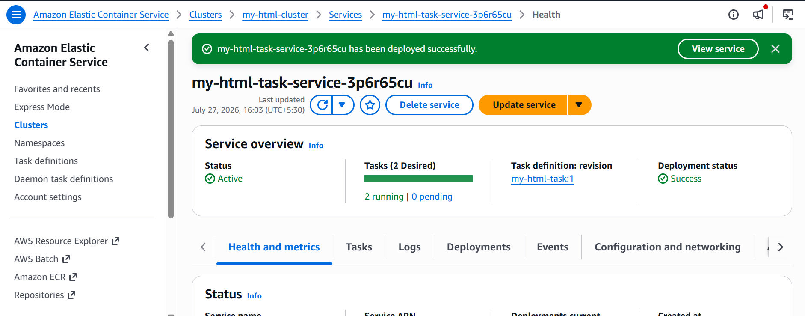

# 🚀 Deploy a Static HTML Website to AWS ECS Fargate Using Docker and Amazon ECR

This project demonstrates how to containerize a static HTML website using **Docker**, push it to **Amazon ECR (Elastic Container Registry)**, and deploy it as a serverless container using **AWS ECS Fargate** — with no EC2 servers to manage at runtime.



---

## 📖 Table of Contents

- [Architecture](#-architecture)
- [Prerequisites](#-prerequisites)
- [Step 1: Launch an EC2 Instance](#step-1-launch-an-ec2-instance)
- [Step 2: Install AWS CLI](#step-2-install-aws-cli)
- [Step 3: Install Docker](#step-3-install-docker)
- [Step 4: Create the Project Directory](#step-4-create-the-project-directory)
- [Step 5: Create the HTML Page](#step-5-create-the-html-page)
- [Step 6: Create the Dockerfile](#step-6-create-the-dockerfile)
- [Step 7: Build the Docker Image](#step-7-build-the-docker-image)
- [Step 8: Run the Docker Container Locally](#step-8-run-the-docker-container-locally)
- [Step 9: Create an Amazon ECR Repository](#step-9-create-an-amazon-ecr-repository)
- [Step 10: Log in to Amazon ECR](#step-10-log-in-to-amazon-ecr)
- [Step 11: Tag the Docker Image](#step-11-tag-the-docker-image)
- [Step 12: Push the Image to ECR](#step-12-push-the-image-to-ecr)
- [Step 13: Create an ECS Cluster](#step-13-create-an-ecs-cluster)
- [Step 14: Create a Task Definition](#step-14-create-a-task-definition)
- [Step 15: Create an ECS Service](#step-15-create-an-ecs-service)
- [Step 16: Access the Website](#step-16-access-the-website)
- [Project Folder Structure](#-project-folder-structure)
- [Screenshots](#-screenshots)
- [Author](#-author)

---

## 🏗 Architecture

The deployment pipeline flows from local development all the way to a publicly accessible URL served by a fully managed container:

```
HTML Website
     │
     ▼
Docker Image
     │
     ▼
Amazon ECR (Image Registry)
     │
     ▼
ECS Task Definition (Blueprint)
     │
     ▼
AWS Fargate Service (Serverless Compute)
     │
     ▼
Public URL (Accessible over the Internet)
```

**Why this stack?**
- **Docker** packages the website and its runtime (nginx) into a single, portable image.
- **Amazon ECR** stores that image securely and integrates natively with ECS.
- **ECS Fargate** runs the container without provisioning or managing any EC2 servers — AWS handles the underlying infrastructure.

---

## ✅ Prerequisites

- An AWS account with permissions for EC2, ECR, and ECS
- A key pair (`.pem` file) for SSH access to EC2
- Basic familiarity with the Linux terminal

---

## Step 1: Launch an EC2 Instance

This EC2 instance is used purely as a **build machine** — to install Docker, build the image, and push it to ECR. It is not part of the final running website.

1. Launch an **Ubuntu** EC2 instance.
2. Attach an **IAM role** granting Amazon ECR permissions (e.g. `AmazonEC2ContainerRegistryFullAccess`).
3. Connect to the instance using SSH:

```bash
ssh -i key.pem ubuntu@<EC2-PUBLIC-IP>
```

---

## Step 2: Install AWS CLI

The AWS CLI lets you authenticate and interact with AWS services (like ECR) directly from the terminal.

```bash
sudo apt update
sudo apt install awscli -y
```

**Verify the installation:**

```bash
aws --version
```

**Verify the attached IAM role is active:**

```bash
aws sts get-caller-identity
```

---

## Step 3: Install Docker

Docker is used to build and run the container image for the website.

```bash
# Update package lists
sudo apt update

# Install Docker
sudo apt install docker.io -y

# Start the Docker service
sudo systemctl start docker

# Enable Docker to start on boot
sudo systemctl enable docker

# Allow the current user to run Docker without sudo
sudo usermod -aG docker $USER
```

> ⚠️ **Log out and log back in** for the group change to take effect.

**Verify Docker is installed:**

```bash
docker --version
```

**Test Docker with a sample container:**

```bash
docker run hello-world
```

---

## Step 4: Create the Project Directory

```bash
mkdir my-html-project
cd my-html-project
```

---

## Step 5: Create the HTML Page

```bash
nano index.html
```

Paste your HTML content and save the file (`Ctrl + O`, then `Ctrl + X` in nano).

**Verify the file contents:**

```bash
cat index.html
```

---

## Step 6: Create the Dockerfile

The Dockerfile defines how the website is packaged into a container image, using **nginx** as the lightweight web server.

```bash
nano Dockerfile
```

**Dockerfile contents:**

```dockerfile
FROM nginx:latest

COPY index.html /usr/share/nginx/html/index.html

EXPOSE 80
```

**Verify the files in the directory:**

```bash
ls -l
```

---

## Step 7: Build the Docker Image

```bash
docker build -t my-html-app .
```

**Verify the image was created:**

```bash
docker images
```

---

## Step 8: Run the Docker Container Locally

```bash
docker run -d --name my-html-container -p 8080:80 my-html-app
```

**Check the running container:**

```bash
docker ps
```

**Test locally with curl:**

```bash
curl http://localhost:8080
```

**Or open in a browser:**

```
http://<EC2-PUBLIC-IP>:8080
```

**Stop and remove the container (optional cleanup):**

```bash
docker stop my-html-container
docker rm my-html-container
```

---

## Step 9: Create an Amazon ECR Repository

1. Open the **Amazon ECR** console.
2. Create a **Private** repository named:

```
my-html-app
```

---

## Step 10: Log in to Amazon ECR

Authenticate Docker with your ECR registry so you can push images to it.

```bash
aws ecr get-login-password --region us-east-2 | docker login --username AWS --password-stdin <ACCOUNT_ID>.dkr.ecr.us-east-2.amazonaws.com
```

---

## Step 11: Tag the Docker Image

ECR requires images to be tagged with the full repository URI before pushing.

```bash
docker tag my-html-app:latest <ACCOUNT_ID>.dkr.ecr.us-east-2.amazonaws.com/my-html-app:latest
```

---

## Step 12: Push the Image to ECR

```bash
docker push <ACCOUNT_ID>.dkr.ecr.us-east-2.amazonaws.com/my-html-app:latest
```

✅ Verify the image now appears in your Amazon ECR repository in the AWS Console.

---

## Step 13: Create an ECS Cluster

1. Open the **Amazon ECS** console.
2. Click **Create Cluster**.
3. Choose **AWS Fargate** as the infrastructure type.
4. Name the cluster:

```
my-html-cluster
```

---

## Step 14: Create a Task Definition

A **Task Definition** is the blueprint ECS uses to run your container — it tells ECS which image to use, how much CPU/memory to allocate, and which ports to expose.

**Configuration:**

| Setting | Value |
|---|---|
| Family | `my-html-task` |
| Launch Type | AWS Fargate |
| Operating System | Linux |
| CPU | 0.25 vCPU |
| Memory | 0.5 GB |
| Execution Role | `ecsTaskExecutionRole` |

**Container settings:**

| Setting | Value |
|---|---|
| Name | `my-html-container` |
| Image | ECR Image URI |
| Port Mapping | 80 |

Save the task definition once configured.



---

## Step 15: Create an ECS Service

A **Service** keeps the desired number of tasks (containers) running continuously and restarts them if they fail.

1. Open the cluster.
2. Click **Create Service**.

**Service settings:**

| Setting | Value |
|---|---|
| Launch Type | AWS Fargate |
| Task Definition | Latest revision |
| Desired Tasks | 1 |

**Networking settings:**

| Setting | Value |
|---|---|
| VPC | Default VPC |
| Subnets | Public subnets |
| Assign Public IP | Enabled |
| Security Group | Allow inbound HTTP (port 80) |

Click **Create Service** to deploy.



Once deployed, the ECS console shows the service as **Active**, with the desired tasks running successfully.



---

## Step 16: Access the Website

Find the public IP address of the running task:

```
Cluster → Service → Tasks → Networking → ENI → Public IPv4 Address
```

Open the IP in a browser:

```
http://<PUBLIC-IP>
```

🎉 Your website should now be live, served by nginx running inside an ECS Fargate container.

---

## 📁 Project Folder Structure

```
my-html-project/
│
├── Dockerfile
├── index.html
└── README.md
```

---

## 🖼 Screenshots

| Screenshot | Description |
|---|---|
|  | Website successfully served from ECS Fargate |
|  | ECS Task Definition configuration (`my-html-task:1`) |
|  | ECS Service deployed successfully on `my-html-cluster` |
|  | ECS Service health showing active tasks running |

---

## 👤 Author

**Created by Nikhil**

---

## 🏷 Tech Stack

- **Docker** — containerization
- **Amazon ECR** — container image registry
- **Amazon ECS (Fargate)** — serverless container orchestration
- **Nginx** — lightweight web server
- **AWS CLI** — command-line automation
